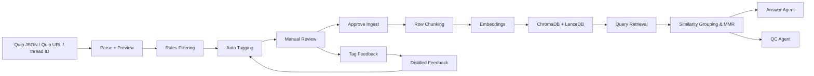
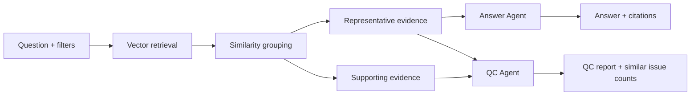

# 项目架构全景图

> 手动刷新版。之前那份自动地图已经把退役功能也一起供上神坛了，这份才是当前现役结构。

**运行命令：** `npm run dev`

---

## 1. 当前产品边界

前端现役功能只有 3 条主链路：

- `Preview`
- `Manage`
- `Query`

非现役说明：

- `Compare` 已移出当前产品流
- `Taxonomy` 已收敛为 `Tag`
- `Analyze / Stats / Dashboard` 不再作为独立前端工作台存在

---

## 2. 当前 AI 协作分工

### Tagging Agent

职责：

- 给 row chunk 自动打 `category_tag`
- 生成 `detail_tags`
- 输出 `confidence`
- 不确定时标记 `review_required`

分类大类固定为：

- `Translation`
- `Voice Over`
- `Animation`

### Answer Agent

职责：

- 基于代表证据回答问题
- 允许轻度归纳
- 不允许脱离证据自由飞翔

### QC Agent

职责：

- 审核答案是否被证据支撑
- 汇总相似问题组数量
- 标记 `pass / warning / fail`
- 提示是否需要人工介入

### Feedback Distill Agent

职责：

- 从人工纠错中提炼规则
- 保留少量代表样例
- 生成给自动打标使用的蒸馏记忆层

---

## 3. 程序入口

### 前端入口

- `frontend/src/App.tsx`
  - 依赖：
    - `frontend/src/components/preprocess/PreviewTab.tsx`
    - `frontend/src/components/manage/ManageTab.tsx`
    - `frontend/src/components/query/QueryTab.tsx`
    - `frontend/src/api/client.ts`

### 后端入口

- `backend/main.py`
  - 依赖：
    - `backend/config.py`
    - `backend/api/__init__.py`
    - `backend/services/__init__.py`

---

## 4. UI 结构

- `frontend/src/components/preprocess/PreviewTab.tsx`
  - 负责：
    - 上传 JSON
    - 直接抓 Quip
    - 预览结果
    - 初始 tag 编辑
    - 入库前检查
- `frontend/src/components/preprocess/ProcessedView.tsx`
  - 负责：
    - row 级预览
    - tag 展示与编辑
    - QC 信息展示
- `frontend/src/components/manage/ManageTab.tsx`
  - 负责：
    - 审核队列
    - 文档管理
    - 错题本蒸馏
- `frontend/src/components/query/QueryTab.tsx`
  - 负责：
    - 查询输入
    - 代表证据展示
    - 补充证据展开
    - QC 结果展示

---

## 5. 后端主要模块

### API 层

- `backend/api/preprocess.py`
  - `/preprocess/preview`
  - `/preprocess/pull-quip`
  - 负责 preview 与 Quip 抓取
- `backend/api/tags.py`
  - 行级 tag 读写
  - 审核队列
  - 错题本蒸馏
- `backend/api/query.py`
  - `/query` 为当前主查询入口
  - `/query/compare` 仅保留兼容，不是现役主流程
- `backend/api/documents.py`
  - 文档列表
  - 文档统计
  - chunk 查看
  - 文档元数据更新与删除

### Models 层

- `backend/models/tags.py`
  - `RowTag`
  - `DocTags`
- `backend/models/query.py`
  - `QueryFilters`
  - `QueryRequest`
  - `Citation`
  - `SimilarEvidenceGroup`
  - `QueryDebug`
  - `QueryResponse`

### Services 层

- `backend/services/quip_parser.py`
  - 解析 Quip JSON / HTML / table rows
- `backend/services/auto_tagger.py`
  - 自动打 `category_tag + detail_tags + confidence`
- `backend/services/chunker.py`
  - 把每个保留 row 变成 row chunk
- `backend/services/rag_engine.py`
  - 检索
  - 相似归并
  - 代表证据选择
  - 答案生成
  - QC 汇总
- `backend/services/vector_store.py`
  - 上层 facade
  - 负责写入 / 查询 / stats
- `backend/services/tags_store.py`
  - 保存和读取行级 tag

---

## 6. 存储架构



说明：

- `ChromaDB` 负责主向量检索
- `DuckDB + LanceDB` 负责结构化统计、审核辅助和补充分析
- 为什么需要多种存储引擎？因为每个数据库都有自己擅长的事情（ChromaDB 做相似度搜索，DuckDB 做复杂统计分析），这比强迫一个数据库支持所有类型更靠谱。
- 错题本分两层：
  - 原始反馈：完整保存每次人工修正
  - 蒸馏反馈：提炼规则、保留少量代表样例，用作后续 Few-shot Guidance

---

## 7. 当前数据口径与架构教训

核心单位：

```text
一行 = 一个问题 = 一个 chunk = 一个统计单位
```
这样的建模带来的好处：
- 每条 issue 都能单独过滤、检索、审核。
- 统计口径清晰，不会变成“一个文档算一个问题”这种无法追踪的大型玄学。
- Query 可以精确引用具体的那一行作为证据。

### 核心架构原则

1. **Local-first**: 数据、向量库、反馈记录尽量保存在本地。
2. **Human-in-the-loop**: 自动打标不是终点，人工审核是系统闭环的关键环节。
3. **Evidence-first**: LLM 的回答必须由具体的检索证据驱动，并接受 QC 的事后审核。
4. **Decoupled surfaces**: `Preview`、`Manage`、`Query` 各司其职。避免在一个界面做“万能控制台”。
5. **Contract Alignment**: 当后端数据结构改变时，需要同时更新核心链路和兜底逻辑（包括 Preview、Manage、Query 及其 TypeScript 接口定义），防止 Contract Drift。
6. **Simplicity over Control**: 在系统演进中，我们移除了旧版的独立仪表盘、复杂的分类学视图和比较系统（Compare/Taxonomy/Dashboard），更偏好将复杂分析收敛在 Query 流和清晰的 Review 中。反馈和 QC 才是产品的核心，仪表板只是辅助。

当前主分类字段：

- `category_tag`
- `detail_tags`
- `confidence`
- `review_required`
- `review_reason`
- `feedback_note`

兼容字段说明：

- `taxonomy_*` 仍在部分模型与存储兼容链路中保留
- 现行业务语义请以 `Tag` 体系为准

---

## 8. Query 证据流



产品行为：

- 默认展示代表证据
- 支持展开查看补充证据
- QC 失败时仍显示答案，但要用警告态提示并展开具体问题

---

## 9. 当前验收状态

统一检查命令：

```bash
npm run check
```

当前文档口径以这套架构为准。谁再拿旧版 `Compare + Taxonomy + Dashboard 大巡游` 来指挥代码，谁就等于邀请 bug 回来做开业剪彩。
