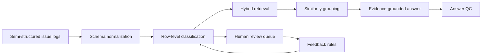

# IssueAtlas

> An evidence-led issue intelligence MVP for project managers.

[Live demo](https://fin77n-ai.github.io/quip-rag-mvp/) | [Product case study](docs/CASE_STUDY.md) | [Architecture](ARCHITECTURE.md)

IssueAtlas turns years of semi-structured project issue logs into a system that
can be searched, reviewed, traced, and acted on. It is based on a real workflow
problem; every record and organization in this public repository is synthetic.

## The Problem

Project managers often inherit years of issue logs spread across collaborative
documents. The tables look similar, but column names, category language, and
ownership fields drift over time. As a result:

- recurring issues remain hidden inside individual launches;
- vendor and sprint comparisons use inconsistent definitions;
- AI summaries sound useful but are hard to verify;
- follow-up depends on manual reading and personal memory.

## MVP Workflow

1. **See the pattern:** compare issue volume by sprint, vendor, locale, and category.
2. **Ask with evidence:** query the corpus and inspect the exact supporting rows.
3. **Review uncertainty:** correct low-confidence classifications before they affect reporting.
4. **Normalize history:** preview how legacy column names map into one stable schema.

The hosted build runs entirely on deterministic synthetic fixtures. It needs no
login, API key, or private backend.

## Product Decisions

| Decision | Why |
| --- | --- |
| One row equals one issue and one evidence chunk | Keeps analytics, review, and citations traceable to the same unit. |
| Human review below the confidence threshold | Prevents uncertain AI labels from silently corrupting trend data. |
| Group similar evidence before generation | Reduces repetitive citations and makes recurring patterns visible. |
| Answer QC with citation coverage | Treats groundedness as a product state, not an invisible prompt detail. |
| Synthetic public mode | Preserves the workflow without exposing company data or credentials. |

## AI System



The reference backend includes FastAPI, row-level metadata, hybrid retrieval,
MMR, evidence grouping, and a feedback loop. The public browser demo uses the
same TypeScript contracts through a fixture adapter.

## What To Validate Next

The MVP demonstrates a coherent workflow, not production impact claims. In a
pilot, I would measure:

- time to answer a cross-sprint issue question;
- percentage of AI claims opened or verified through citations;
- review queue precision and median handling time;
- duplicate issue detection rate;
- percentage of open issues with an owner and next action.

## Run Locally

```bash
npm install
npm install --prefix frontend
npm run dev:demo
```

Open `http://localhost:5173`. Synthetic Demo mode is enabled by default.

To inspect the reference backend, install the Python dependencies and set
`VITE_DEMO_MODE=false`. External service credentials are optional and must stay
in an untracked `.env` file.

## Checks

```bash
npm run check
```

This builds the frontend and scans tracked files for forbidden runtime data,
likely credentials, and internal domains.

## Live Demo

GitHub Pages deployment is configured in `.github/workflows/deploy-pages.yml`.
After Pages is enabled for GitHub Actions, every push to `main` publishes the
synthetic demo.

## Repository Map

```text
frontend/   React product experience and synthetic demo adapter
backend/    FastAPI reference implementation
docs/       Product case study and portfolio notes
scripts/    Public-repository safety checks
```

## Privacy

This repository was created with a new Git history. It does not contain the
original source documents, local databases, vector indexes, production IDs, or
credentials. Fictional names and records are used throughout the demo.
